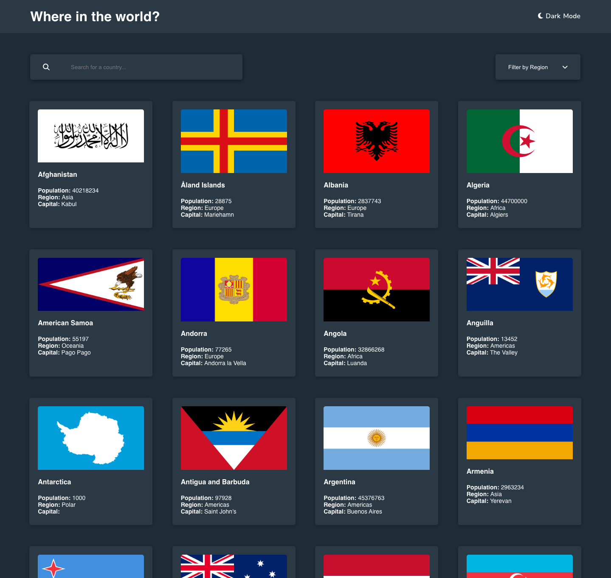
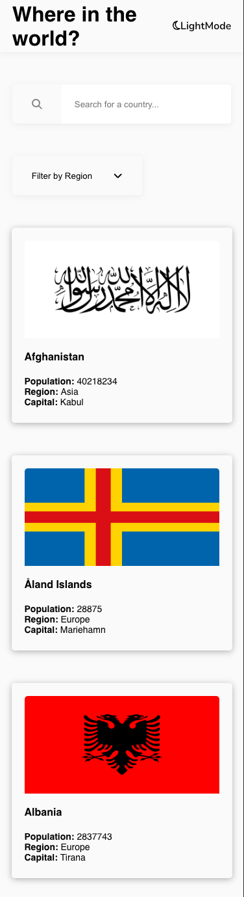

# Frontend Mentor - REST Countries API with color theme switcher solution

This is a solution to the [REST Countries API with color theme switcher challenge on Frontend Mentor](https://www.frontendmentor.io/challenges/rest-countries-api-with-color-theme-switcher-5cacc469fec04111f7b848ca). Frontend Mentor challenges help you improve your coding skills by building realistic projects. 

## Table of contents

- [Overview](#overview)
  - [The challenge](#the-challenge)
  - [Screenshot](#screenshot)
  - [Links](#links)
- [My process](#my-process)
  - [Built with](#built-with)
  - [What I learned](#what-i-learned)
  - [Continued development](#continued-development)
  - [Useful resources](#useful-resources)
- [Author](#author)
- [Acknowledgments](#acknowledgments)

## Overview

### The challenge

Users should be able to:

- See all countries from the API on the homepage ✅
- Search for a country using an `input` field ✅
- Filter countries by region ✅
- Click on a country to see more detailed information on a separate page ✅
- Click through to the border countries on the detail page ✅
- Toggle the color scheme between light and dark mode *(optional)* ✅

### Screenshot

### Links

- Solution URL: https://github.com/benhensor/countries_api.git
- Live Site URL: [Add live site URL here](https://your-live-site-url.com)

## My process

### Built with

- Semantic HTML5 markup
- CSS custom properties
- Flexbox
- CSS Grid
- Mobile-first workflow
- [React](https://reactjs.org/) - JS library

### What I learned

Key takeaways from this project center around building search and filter capabilities. In particular, how and when to clear state is a key consideration. This is also the first time I've attempted implmenting a light/dark mode. Actually pretty straightforward once you understand a coulple of core concepts. 

### Continued development

This project is pretty basic and I chose to follow the prescribed design. I would probably work on an improved visual look and feel to make the project more substantial. I would also enhance interative elements to improve UX. 

## Author

- Website - [Ben Hensor](https://benhensordev.netlify.app/)
- Frontend Mentor - [@yourusername](https://www.frontendmentor.io/profile/yourusername)
- Twitter - [@yourusername](https://www.twitter.com/yourusername)